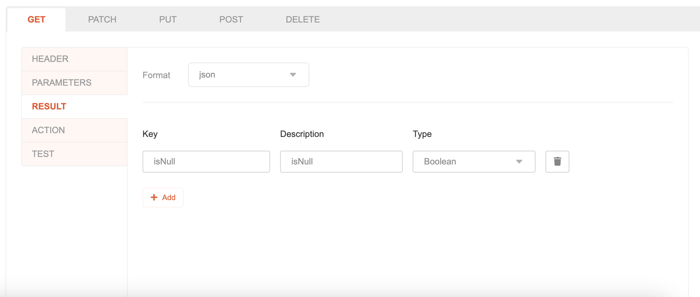
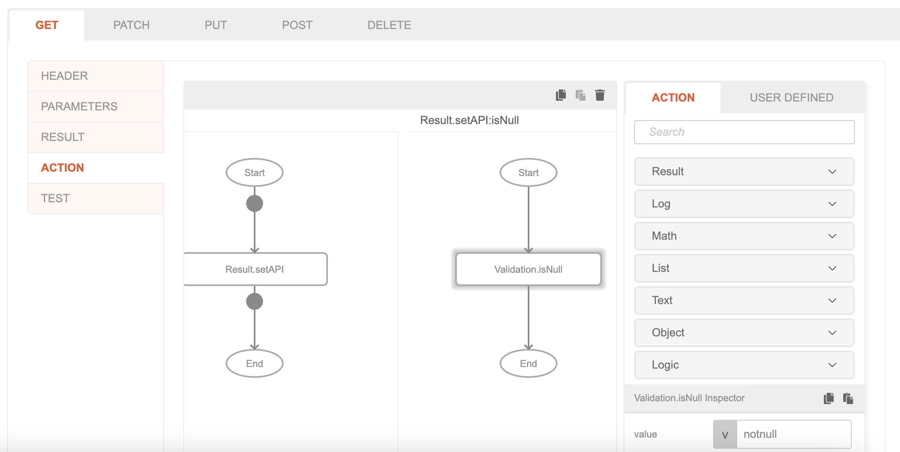
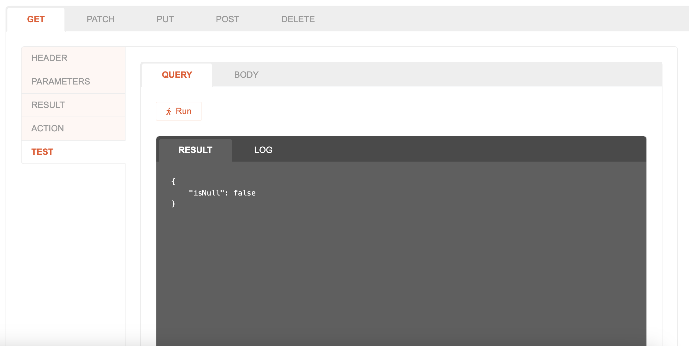

# Validation.isNull

## Description

Validates a value if it is null 

## Input / Parameter

| Name | Description | Input Type | Default | Options | Required |
| ------ | ------ | ------ | ------ | ------ | ------ |
| value | The value to to validate. | Any | - | - | Yes |

## Output

| Description | Output Type |
| ------ | ------ |
| Returns the validation value. | Boolean |

## Callback

N/A

## Video

Coming Soon.

## Example

In this example, we will check whether a value is null and get the validation using `Validation.isNull` and `Result.setApi` function.

### Step

1. Create an api and select on any api method tab, and select the secondary tab `Result`. Select `json` format and add new json key `isNull` as the key with `boolean` type.

2. Select the secondary tab `Action`, Call the function `Result.setApi` and change the param type of `isNull` to subflow/function, drag `Validation.isNull` on it and add `nonull` value on it's `value` param.

### Result

1. Select the secondary tab `Test`, click on run button and check the json response, it will show {"isNull": false} because `nonull` is not a null value.

## Links