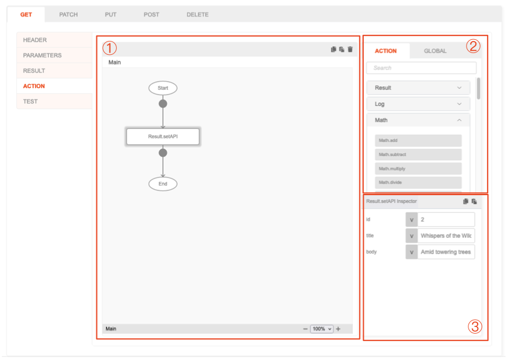
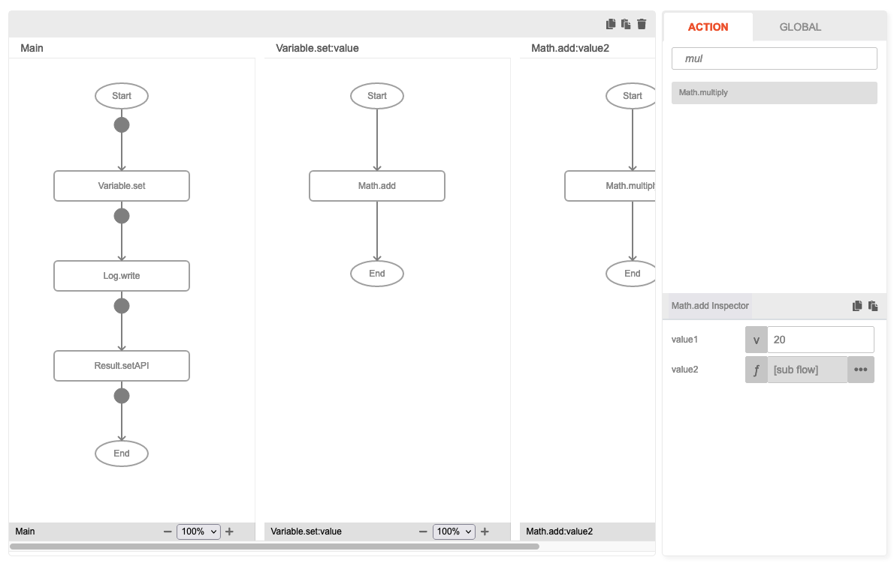
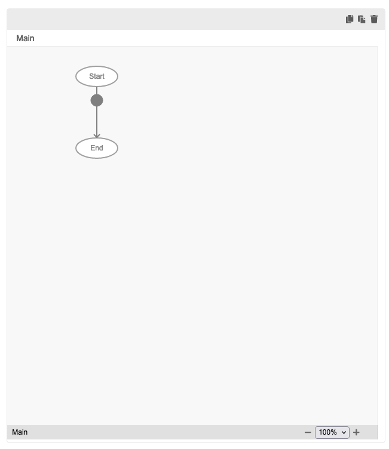
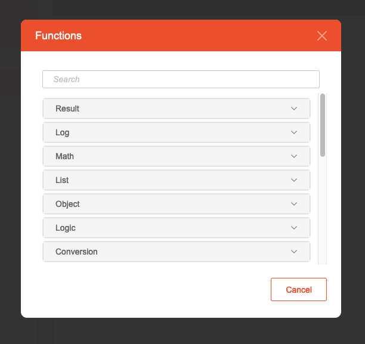

# Action

## Description

Create the functionality of the API by utilizing the existing function blocks available in this section. Combine these
function blocks cohesively to execute a desired task effectively.

## Overview

1. **Action flow**: A workspace to build the flow of functions.
2. **Function list**: A list of eMOBIQ function block for use.
3. **Inspector**: Modify the input parameters of a function block.

* An Action can have a set of function block arranged in a flow.
* A flow can have sub-flows, in which the result will be propagated up to its parent flow and ultimately, to the main
  flow.
  

## How to use

### Building the flow

1. A brand new Action Flow will have a **Start** and **End** terminating block.
   
2. Look for the function block to use in the Function List window, use the search field to quickly find the desired
   block. (Refer to the documentation under the "Function" section to obtain more detailed information about the function block).
3. Drag and drop the block to use to the connection point (represented by the black circle between each block in flow).
   * Alternatively, you may right click the connection point to quickly insert function block at the exact place. A function selection popup will appear.
   
4. Proceed with the remaining blocks and advance through the process until completion. Remember to use the `Result.setAPI` block to terminate the API flow and assign a result.

### Copy & paste a function block
1. Inside the action flow, highlight the function block to copy.
2. On the top right of the action flow window, click on the `Copy` icon. The block will be copied into the internal clipboard.
3. Highlight a connection point you want to place the block to.
4. On the top right of the action flow window, click on the `Paste` icon. The block will then be pasted at the position just under the connection point.

### Removing a function block
1. Inside the action flow, highlight the function block to remove.
2. On the top right of the action flow window, click on the `Delete` icon. 
3. Confirm the deletion, and the block, including its subflow if available, will be removed.

