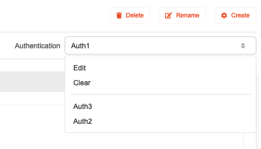
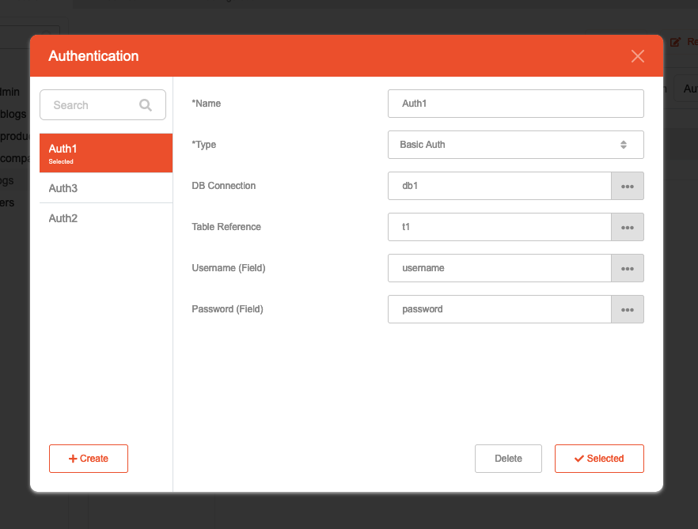

# API - Authentication

## Description

Authentication can be applied to this API, which provide access protections and will require privilege to use them. This is useful if you want to restrict some parts of the API to limited users and not make them public.

## Example use case

* Allow only registered users to access certain exclusive Actions.
* Allow only administrators account to access sensitive Actions.

## Supported types

1. **Basic Auth**: Uses username and password pair to gain access for authorization, and will need to be attached on client request.
2. **OAuth2**: Uses token, which the client needs to obtain from a specialized endpoint. Tokens need to be attached on client request.
   * For more information, you may look on the OAuth2 reference, which is accessible by selecting the icon button beside the Authentication dropdown.
      

## How to use

1. Highlight an Action or Folder you want to have Authentication on.
   * **Action**: Selecting an Action will apply protection on that particular item.
   * **Folder**: Selection a Folder will apply protection on all Actions inside them, including Action inside sub-folders.
2. On the top right, under Authentication dropdown, select it to reveal available Authentication for use. You may also edit Authentication, or remove it entirely from API
    
    * To create new Authentication, select **Edit**.
3. When selecting **Edit**, a configuration popup will be shown, and allows Authentication to be configured and edited.
   
   * Authentication can be used more than one time, and can be applied to multiple parts of the API.
4. The following fields are available.
   * **Name**: a unique name to identify this Authentication.
   * **Type**: **Basic Auth** or **OAuth2**.
   * **DB Connection**: which database to use.
   * **Table Reference**: which table to use.
   * **Username**: which field to search for username.
   * **Password**: which field to search for password.

## Note
Please create the desired database first in the **Database** module to usa it when configuring the Authentication.

