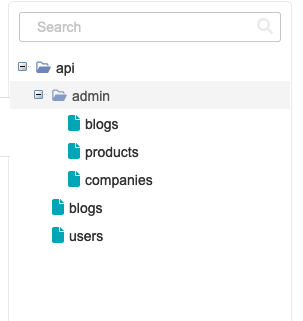
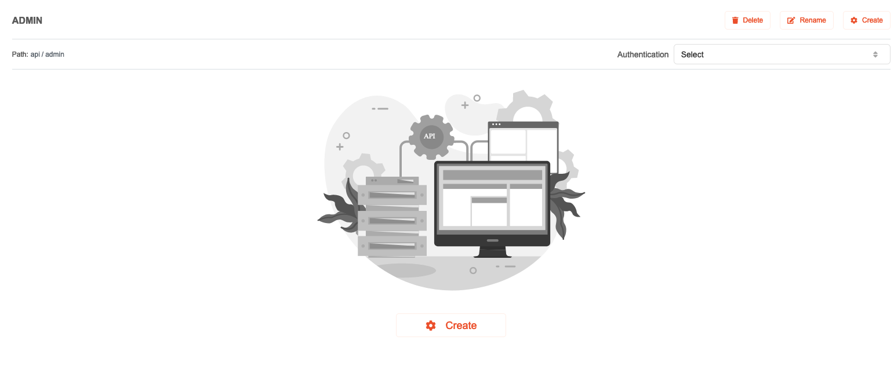
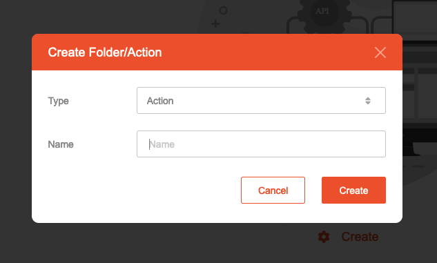
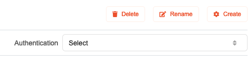
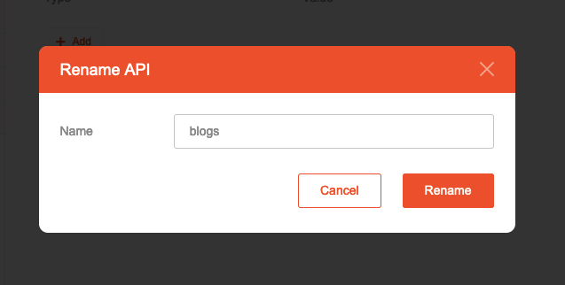

# API - Editing

## Create Action & Folder

To create a new Action or folder,

1. Highlight the folder where you want to place it.
   
2. Select the **Create** button at the middle of the main section.
   
3. Select the type and enter a name for the Action or Folder.
   
   Types available:
    * **Action**: Create a new Action.
    * **Folder**: Create a new folder, which may hold one or more Action.
4. The new Action/Folder will be created under the highlighted folder.
5. Alternatively, select the **Create** button on the top right section. The item will be created alongside the currently highlighted Action, if applicable.
   

## Rename Action & Folder

To create a new Action or folder,

1. Select the **Rename** button on the top right section.
   
2. Enter a new name for the Action or folder
   
3. The new name will then be used.

## Delete Action & Folder

To delete a new Action or folder,

1. Highlight the Action or folder which you want to remove.
2. Select the **Delete** button on the top right section.
   
3. Confirm the deletion. The item will then be removed.
