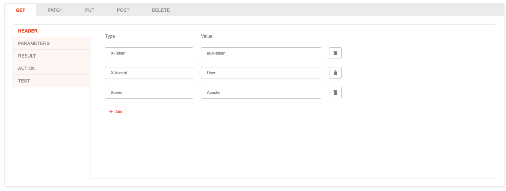

# Header

## Description

Header can be set on Action, which will be sent as part of the response back to the client.

## How to use
1. Open the **Header** tab.
2. For each Action and Method, Headers can be added, edited or deleted.
3. The following fields are available:
   * **Type**: HTTP Header type to use (example: `Content-Type`)
   * **Value**: HTTP Header value to use (example: `application/json`)
       
