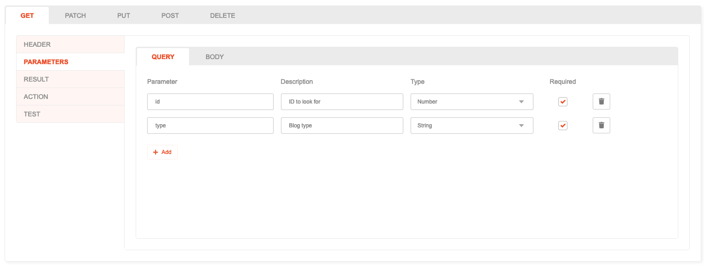
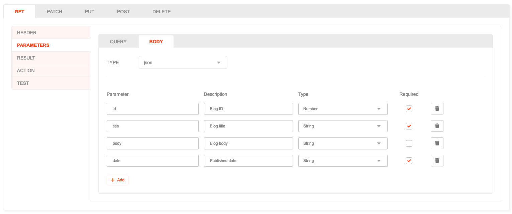
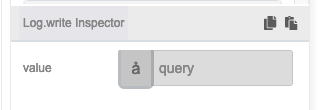
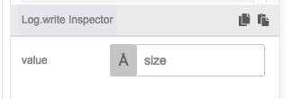
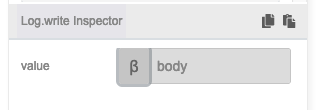
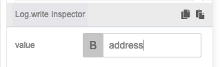

# Parameter

## Description

An Action may read inputs coming from a client request, which can contain supporting data and may be used when running the Action.

There are two types available:

1. **Query**: Short key-value pairs that comes as part of the URL. For instance, `/posts?page=2&per_page=10`
2. **Body**: More complex or large data may appear as part of the client request, and are usually in the form of **text** or **json**.

## Use cases

* Filter products by category, price range, or availability.
* Retrieve a sorted list of items, such as sorting products by name or date added.
* Send user details in the request body for the server to create a new account.

## How to use

1. Open the **Parameter** tab.
2. On the **Query** sub-tab, you can add, edit or remove Queries for your Action, which may contain:
    * **Parameter**: the query key to look for.
    * **Description**: an optional, short explanation of what the parameter is.
    * **Type**: the data type of the parameter, can be either **String**, **Number**, **Boolean** or **List**.
    * **Required**: whether the parameter is required or not.
    
3. On the **Body** sub-tab, you can set a type for the body, which can be in form of:
    * **text**: Read the full text of the body.
    * **json**: Read the body as a JSON. You can specify **Parameter**, **Description**, **Type** and **Required** in the similar manner as setting up Query.
    
4. Inside Action Flow, you can read the contents coming from Query and Body by selecting the desired parameter types.
    * Select **query** to read all contents of the Query as an object.
    
    * Select **queryField** to read a single value of the Query. You'll need to specify the key to read.
    
    * Select **body** to read all contents of the Body. For type **text**, the value will be a string, while for **json**, the value will be an object.
    
    * Select **bodyField** to read a single value of the Body by its key. Note that this is only applicable for body type **json**.
    
