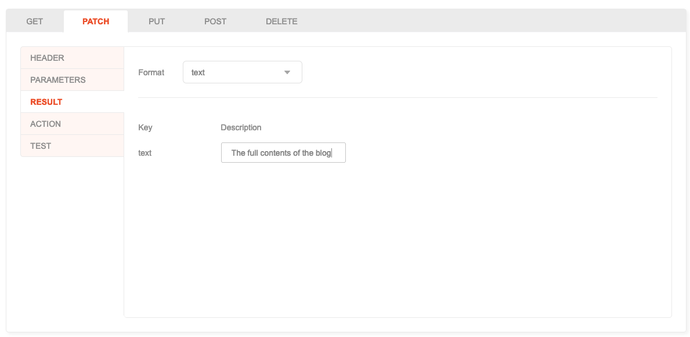
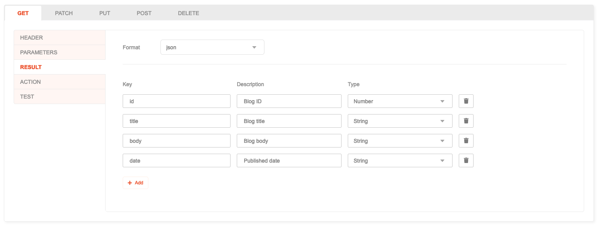
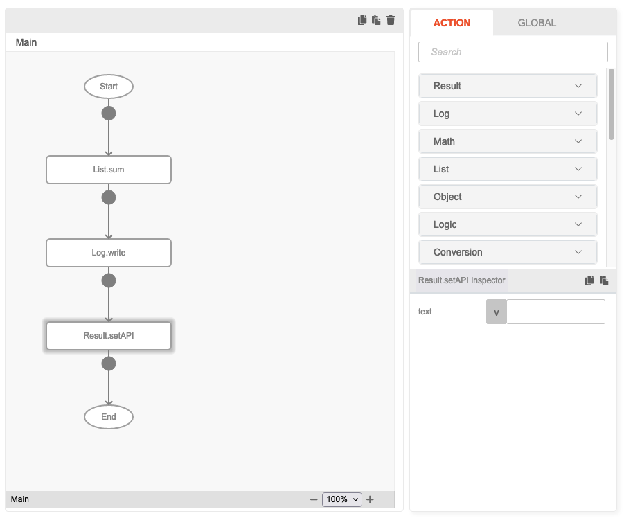
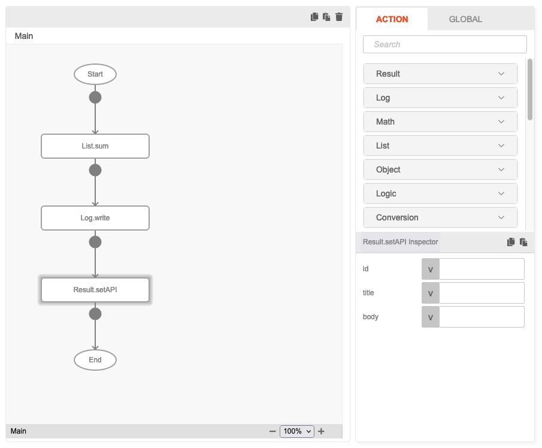

# Result

## Description

An Action will return a result after done running its configured tasks according to the flow.

The returned Result can be in either of these format:

* **text**: Return a full text as a string.
* **json**: Return a structured JSON data.

## How to use

1. Open the **Result** tab.
2. Select the desired format ot the result.
    * By selecting **text**, you can provide an optional description of the returned data.
      
    * By selecting **json**, you need to provide a list of parameter to return, in which will contain the following:
      
        * **Parameter**: the JSON key of the parameter, basically an identifier.
        * **Description**: an optional, short explanation of what the parameter is.
        * **Type**: the data type of the parameter, can be either **String**, **Number**, **Boolean** or **List**.
3. In the Action Flow, use `Result.setAPI` function block to indicate that the task is finished, and also to provide
   the resulting data to return. The Inspector content will change depending on the format set.
   * **text**: A single parameter named "text" will appear.
     
   * **json**: A list of parameter will appear according to the parameter list set in Result earlier.
     
