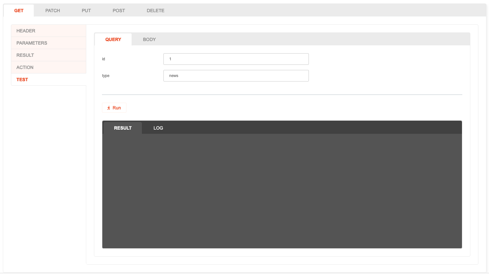
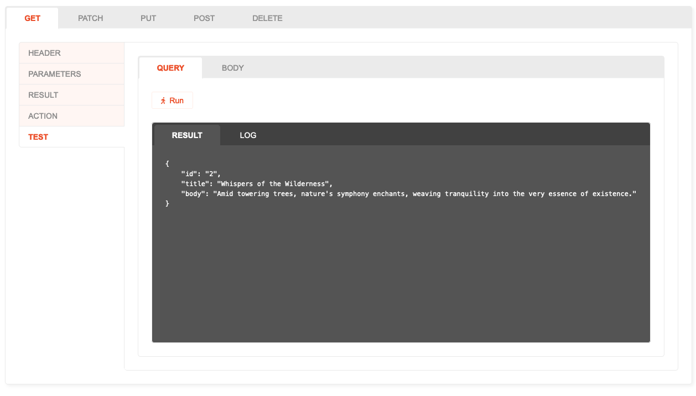
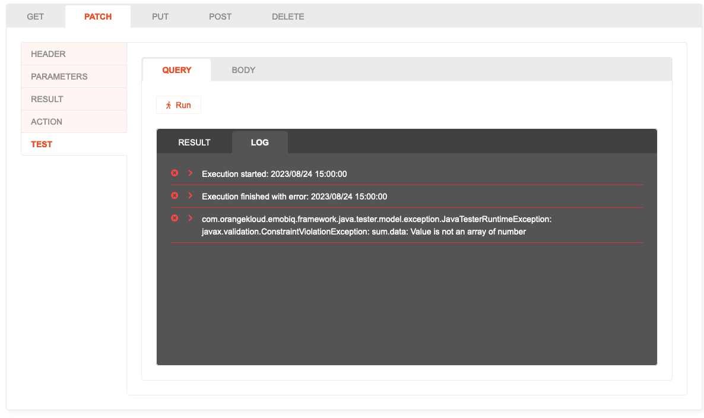

# Testing

## Description

You can test the Action by providing a sample input and simulate running the flow under testing environment.

## How to use
1. Open the **Test** tab.
2. To provide the input, you can select Query or Body sub-tab. Note that you may insert both at the same time, and they will only be available after the corresponding Query/Body is configured before.
   
3. Select **Run** to start testing the Action.
4. After the Action Flow finished executing, the returned Result will be shown on the **Result** tab of the output window.
   
5. Log output from `Log.write`, errors and other status information can be viewed under the **Log** tab.
   
