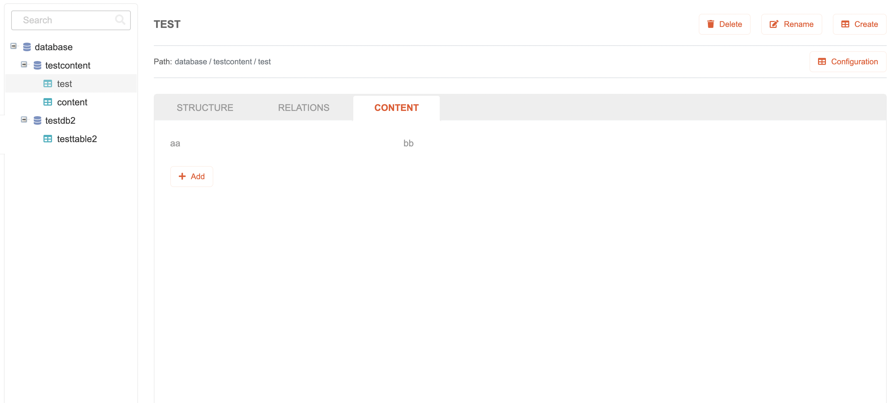
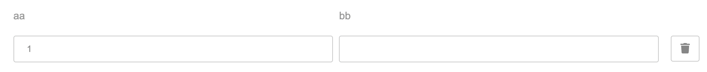
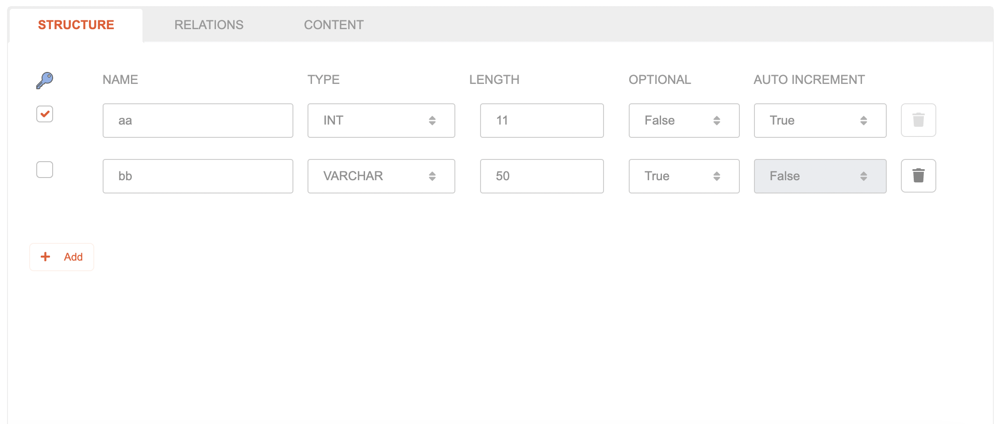

# Table Content

## Create Table Content

To create a new Table Content,

1. Highlight the table which you want to add a content to, then select the **Content** tab.
   
2. Press the **Add** button located inside the table content section.
   
3. A new table content will be added with several empty / default value fields inside
   
   * Available fields:
      The content and it's fields will be dynamically added based from the table structure data
      

## Modifying Table Content

To modify a Table Content,

1. Highlight the table which content you want to modify, then select the **Content** tab.
2. Select the field that you want to modify
   * Available fields:
      The content and it's fields will be dynamically added based from the table structure data
      
3. Modifying the **Name** field
   Type on the field to modify the **Name** value
4. The type for each field in **Content** tab will depends on the table structure type
   * There are 8 types selection:
      * **VARCHAR**
      * **BOOLEAN**
      * **INT**
      * **DATE**
      * **TIME**
      * **DATETIME**
      * **DECIMAL**
      * **BLOB**
   * The detailed information for each supported data type can be found here: `https://mariadb.com/kb/en/data-types/`
5. The changes on the **Content** tab will be automatically saved to the server.

## Delete Table Content

To delete a Table Content,

1. Highlight the table which content you want to delete, then select the **Content** tab.
2. Press the **Delete** button on the right side of a content that need to be removed.
   
