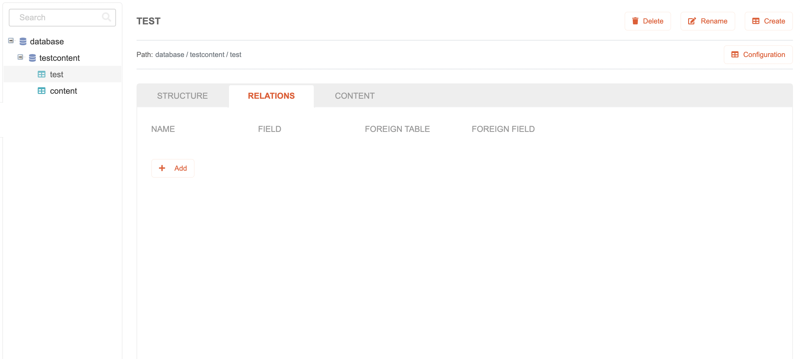

# Table Relations

## Create Table Relations

To create a new Table Relations,

1. Highlight the table which you want to add a relations to, then select the **Relations** tab.
   
2. Press the **Add** button located inside the table relations section.
   
3. A new table relation will be added with several empty / default value fields inside.
   
   Available fields:
      * **Name**
      * **Field**
      * **Foreign Table**
      * **Foreign Field**

## Modifying Table Relations

To modify a Table Relations,

1. Highlight the table which relations you want to modify, then select the **Relations** tab.
2. Select the field that you want to modify
   Available fields:
      * **Name**
      * **Field**
      * **Foreign Table**
      * **Foreign Field**
3. Modifying the **Name** field
   Type on the field to modify the **Name** value
4. Modifying the **Field** field
   Select on the dropdown field to modify the **Field** value
   Notes for **Field** field:
   * The selections are based from the current table structure data, which can be modified by selecting the **Structure** tab.
   * Cannot be empty
   * Empty by default
5. Modifying the **Foreign Table** field
   Select on the dropdown field to modify the **Foreign Table** value
   Notes for **Foreign Table** field:
   * The selections are based from all the tables which belong in the same database with the current table
   * Cannot be empty
   * Empty by default
5. Modifying the **Foreign Field** field
   Select on the dropdown field to modify the **Foreign Field** value
   Notes for **Foreign Field** field:
   * The selections are based from the table structures which belong to the table that has been selected as the **Foreign Table** value
   * Cannot be empty
   * Empty by default

## Delete Table Relations

To delete a Table Relations,

1. Highlight the table which relations you want to delete, then select the **Relations** tab.
2. Press the **Delete** button on the right side of a relation that need to be removed.
   
