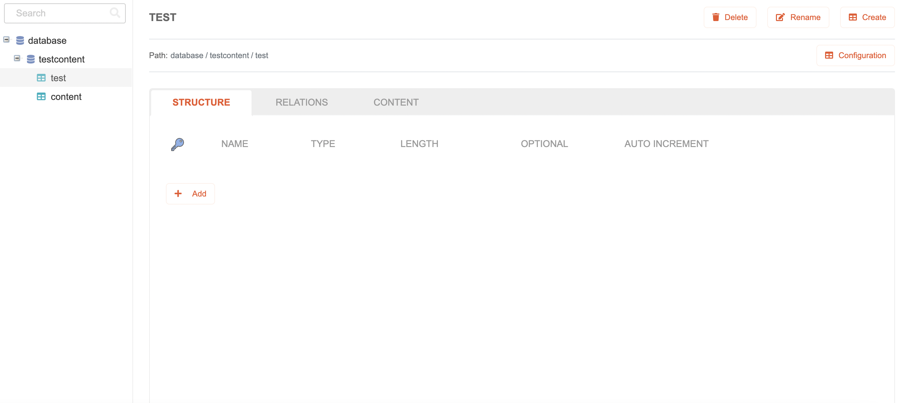
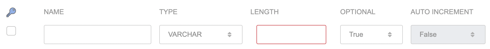

# Table Structure

## Create Table Structure

To create a new Table Structure,

1. Highlight the table which you want to add a structure to, then select the **Structure** tab.
   
2. Press the **Add** button located inside the table structure section.
   
3. A new table structure will be added with several empty / default value fields inside
   
   * Available fields:
      * **Primary Key**
      * **Name**
      * **Type**
      * **Length**
      * **Optional**
      * **Auto Increment**

## Modifying Table Structure

To modify a Table Structure,

1. Highlight the table which structure you want to modify, then select the **Structure** tab.
2. Select the field that you want to modify
   * Available fields:
      * **Primary Key**
      * **Name**
      * **Type**
      * **Length**
      * **Optional**
      * **Auto Increment**
3. Modifying the **Primary Key** field
   
   Check or uncheck the field to modify the **Primary Key** value
   * Notes for **Primary Key** field:
      * One primary key available for every table
      * Once a structure identified as a **Primary Key** (checked), it cannot be deleted unless it has been unchecked again
      * Once a structure identified as a **Primary Key** (checked), it's type cannot be changed unless it has been unchecked again
      * **Auto Increment** field will only be available to modify once a structure identified as a **Primary Key** (checked)
4. Modifying the **Name** field
   Type on the field to modify the **Name** value
   * Notes for **Name** field:
      * Must be unique, cannot have multiple structure with the same name
      * Cannot be empty
      * Empty by default
5. Modifying the **Type** field
   Select on the dropdown field to modify the **Type** value
   * Notes for **Type** field:
      * There are 8 types selection:
         * **VARCHAR**
         * **BOOLEAN**
         * **INT**
         * **DATE**
         * **TIME**
         * **DATETIME**
         * **DECIMAL**
         * **BLOB**
      * The detailed information for each supported data type can be found here: `https://mariadb.com/kb/en/data-types/`
      * **VARCHAR** will be selected by default
6. Modifying the **Length** field
   Type on the field to modify the **Length** value
   * Notes for **Length** field:
      * Some data **Type** cannot have **Length** value
      * Each data **Type** might have a different maximum or minimum **Length** value, refer to: `https://mariadb.com/kb/en/data-types/` for the detailed information
7. Modifying the **Optional** field
   Select on the dropdown field to modify the **Optional** value
   * Notes for **Optional** field:
      * True by default
8. Modifying the **Auto Increment** field
   Select on the dropdown field to modify the **Auto Increment** value
   * Notes for **Auto Increment** field:
      * Only applicable if the type of the structure is an **INT**
      * Only applicable if the structure is a **Primary Key** (checked)
9. Save the project to make the structure usable in the **Content** tab

## Delete Table Structure

To delete a Table Structure,

1. Highlight the table which structure you want to delete, then select the **Structure** tab.
2. Press the **Delete** button on the right side of a structure that need to be removed.
   
3. Take note that if a structure is a  **Primary Key** (checked) it cannot be deleted, and need to be unchecked first if you want to remove it.
4. Save the project to see the structure change in the **Content** tab.
