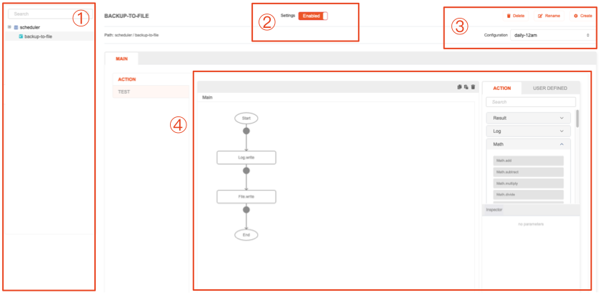

# Scheduler - General

## Description

This module allows to build Actions that may be run under scheduled conditions. That is, you can set up an Action and configure it according to when or how often it should be run.

## Example use cases

* Synchronize data between multiple databases.
* Resource cleanup, delete unneeded cache files periodically.
* Generate a report (analytics, sales record) every certain period of time.
* Conduct database maintenance and cleanup.
* Schedule payment reminders in a subscription-based services or upcoming bill payments.
* Periodically create a social media post for automated user engagement.

## Overview

1. **Scheduler list tree**: List out the Actions created under file-and-folder hierarchical system.
2. **Scheduler enable/disable switch**: Turn it on to let the Action run when scheduler triggers, or turn it off otherwise.
3. **Editing panel**: Create, rename or delete Actions under the scheduler. Also includes Configuration dropdown, where you can configure the scheduler timing for the selected Action.
4. **Action flow**: When the Action tab is selected, allow to build the Action flow itself.
