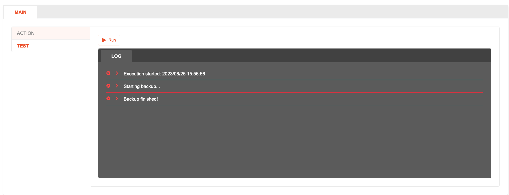

# Scheduler - Testing

## Description

You can test the Action by simulate running the flow under testing environment.

## How to use

1. Make sure the Action flow is created.
2. pen the **Test** tab.
3. Select **Run** to start testing the Action.
4. Log output from `Log.write`, errors and other useful information will be shown on the output window, under the **Log** tab.
   
