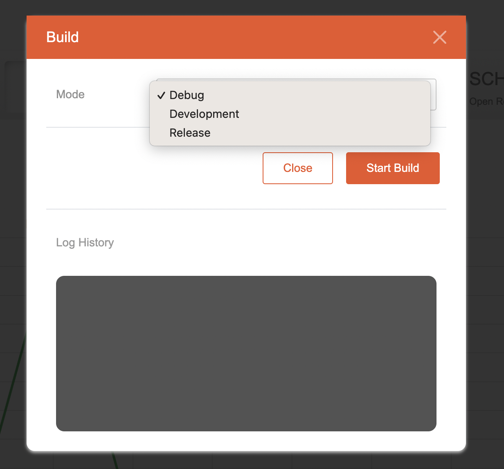
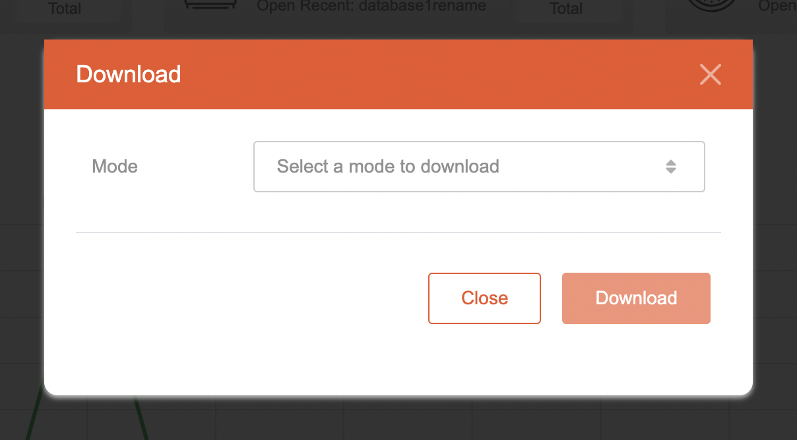

# Editor

## Description

A platform used to create server related modules and provides information related to the application.

***
 
## Header

As shown in the image above, the header consists of:

- Emobiq Logo at the top left to navigate to homepage
- Application's name and version
- Save Button to save the application's current state (as shown in the image below)
- Build button to build the application and check build log histories (as shown in the image below)
- Download button to download the built files
- Help button which will open the Help Modal that contains general instructions for using the Server platform

  
  
  
***

## Main Pages

Currently there are 4 main pages on Server platform which are briefly explained below, for more details please click the title of each menu:

### [Dashboard](Dashboard.md)

This page provides an overview of the application's information and insights that are important to the user.

### [Module](Module.md)

This page is the main part of the platform and where users will spend most of their time designing Server-related modules.

### [Service](Service.md)

This is the page to create connectors and services that will be used inside the Module page.

### [Configuration](Configuration.md)

This page provides control over crucial configurations that will be used mainly by the generated application.

***