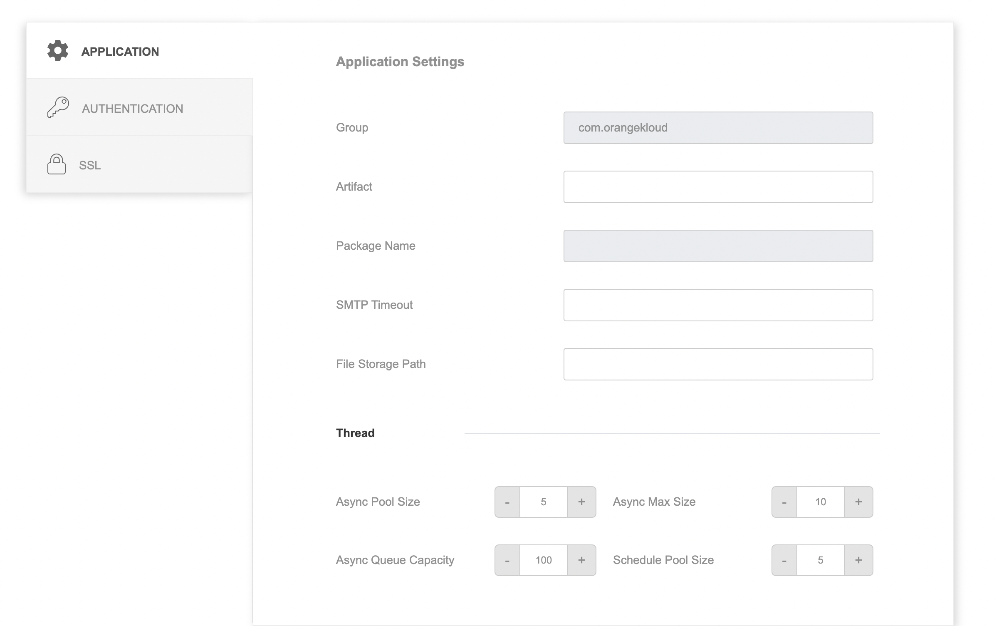
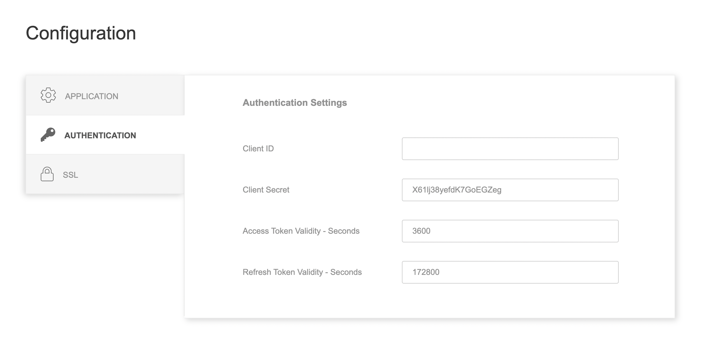
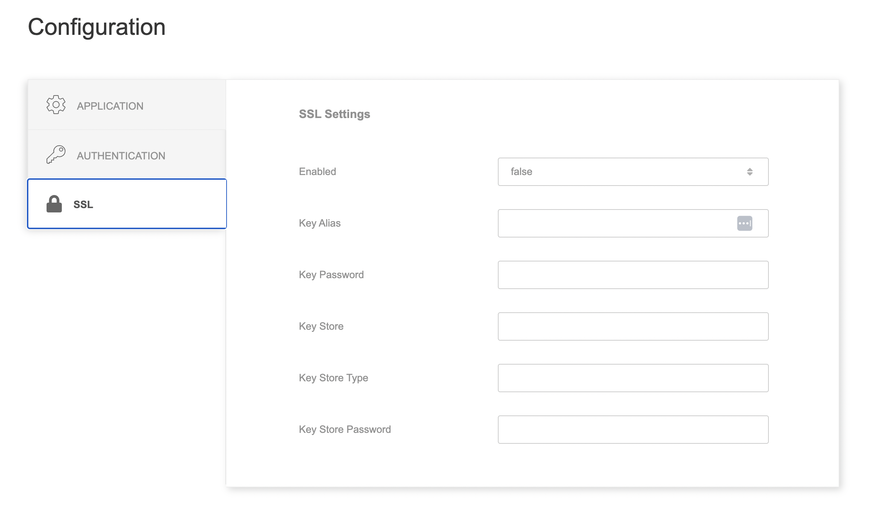

# Configuration

## Description

This page contains various configurations that will be used throughout the application.

Access this page through the configuration menu in the toolbar.

## Application

This is the general configuration of the application:

- **Application Settings**
    - Group: the group identifier or namespace for your project.
    - Artifact: the unique name for your project or application within the group. It's the primary identifier for your application.
    - Package Name: the naming convention used to organize your Java classes that is derived from your group and artifact.
    - SMTP Timeout: refers to the maximum time (in milliseconds) that the email sending operation will wait for a response from the SMTP server before timing out.
    - File Storage Path: refers to the directory location on the server where your application will store uploaded files or other resources.
- **SOAP Connector:** used as a connector for API using SOAP approach.
    - Name: identifier of the connector
    - Url: endpoint of the SOAP Endpoint.
    - Timeout: the configuration for the duration before the api times out.
- **Thread:**
    - Async Pool Size: refers to the number of threads that are available in the asynchronous task execution pool.
    - Async Queue Capacity:: refers to the maximum number of tasks that can be waiting in the queue for execution in the async task pool.
    - Async Max Size: refers to the maximum number of threads that the async task pool can expand to when the pool size is exceeded and the queue is full.
    - Schedule Pool Size: refers to the number of threads available for executing scheduled tasks. 

## Authentication

This is the configuration for oauth2 in the application:

- **Authentication Settings**
    - Client ID: a unique identifier assigned to an application that wants to access resources on behalf of a user.
    - Client Secret: a confidential string or password associated with the client ID. It's used to authenticate the application to the authorization server during the token exchange process.
    - Access Token Validity - Seconds: refers to the period of time (in seconds) for which an access token is considered valid. When a user authorizes a client application to access their resources, the authorization server issues an access token.
    - Refresh Token Validity - Seconds: refers to the period of time (in seconds) for which a refresh token is considered valid.

## SSL

The configuration for the SSL in the application:

- **SSL Settings**
    - Enabled: to enable/disable the SSL.
    - Key Alias: is a human-readable name that uniquely identifies a specific key entry within a keystore.
    - Key Password: is a password associated with the private key stored in the keystore. 
    - Key Store: is a secure container that holds cryptographic keys, certificates, and sometimes trusted certificates.
    - Key Store Key: specifies the format of the keystore file. Common keystore types include Java KeyStore (JKS) and PKCS#12 (often with the .p12 or .pfx extension).
    - Key Store Password: is the password used to protect the entire keystore.

