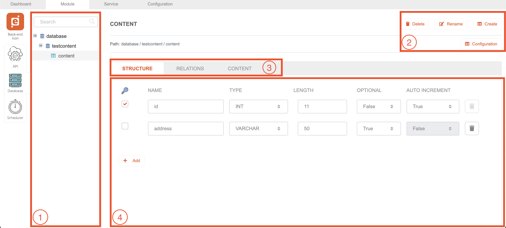

# Database

## Description

This module allow us to create a database, table and it's contents

## Features

- Create, modify, rename and delete existing database
- Configure database host, port, username and password information
- Configure database charset and collation type
- Create, modify, rename and delete existing table
- Configure table engine, charset and collation type
- Create, modify and delete the structure of each table
- Create, modify and delete the relation of each table
- Create, modify and delete contents of the table

## Overview

1. **Database list tree**: Shows the list of Database and Table created under this project (every database and it's tables will be created inside root database which automatically created on project creation and cannot be deleted).
2. **Edit section**: Allow to create, rename or delete currently selected item (except for the root database). In addition,
   contains Configuration button to allow changing configuration on currently selected item.
3. **Table properties tab**: Toggle between table Structure, Relations or Contents section for each table.
4. **Table properties section**: Allow to create, modify and delete table Structure, Relations or Content.
