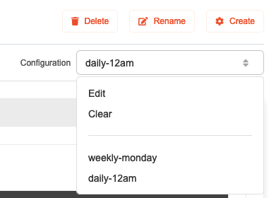
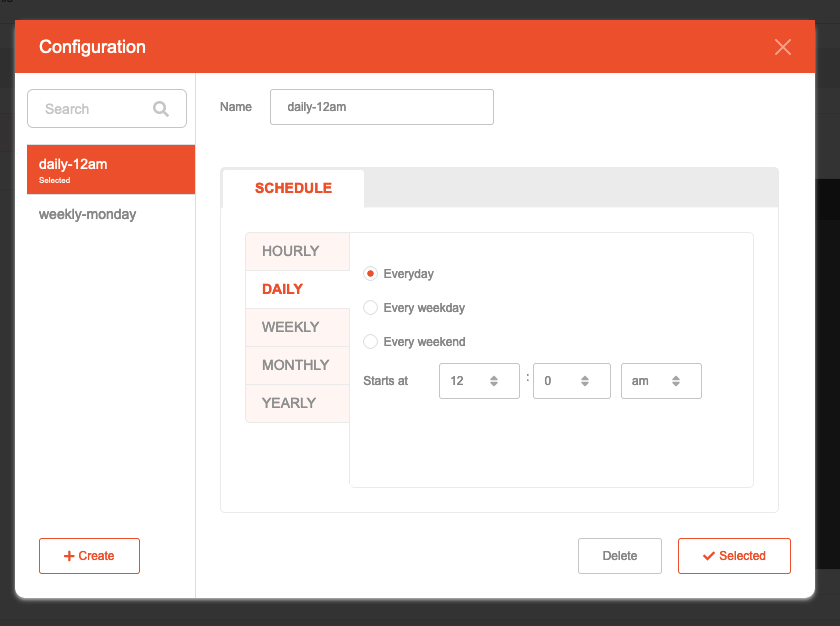

# Scheduler - Configuration

## Description

Each Action can have a Configuration which, among other things, determine when and how often it should run under certain
schedules.

## How to use

1. Select an Action or Folder to apply Configuration on.
2. On the top right of the section, open the Configuration dropdown and select the desired configuration to use.
   
    * To add a new one, select **Edit**, and choose **Create** on the subsequent popup (see next step for more details).
    * To change to the other Configuration, simply select the new one from the dropdown list.
    * To remove the Configuration from currently selected Action/Folder, select **Clear**.
    * Setting a Configuration on a Folder will apply the chosen Configuration to the entire contents of the folder
      including its sub-folders (unless they have been overriden by another Configuration)
3. When selecting **Edit**, you may make adjustments on the Configuration itself.
   
    * A Configuration can be applied to multiple Actions and Folders so they can share the same settings.
    * To create a new Configuration, select **Create** on the bottom left. A new entry named "New Configuration" will be
      shown. Enter the desired name in the **Name** field, fill in the rest of the fields and select **Create** once
      more to save your input.
    * To immediately select a Configuration and assign it to currently selected Action or Folder, click **Select**.
    * To update the existing Configuration, choose the Configuration, make necessary update and select **Update**.
    * To delete the Configuration, choose the Configuration then select **Delete**. Confirm the deletion.
    * The following options are available:
      * **Hourly**: Run the Action every `x` hours, starting from a determined time `hh:mm am/pm`.
      * **Daily**: Run the Action everyday/weekday/weekend at the desired time `hh:mm am/pm`.
      * **Weekly**: Run the Action on specified day of the week (Mon/Tue/Wed/Thu/Fri/Sat/Sun) at the desired time `hh:mm am/pm`. You may set more than one day.
      * **Monthly**: Run the Action on either:
        * Day `x` of every `y` months. For example, the 15th date on calendar every three (3) months.
        * The first/second/third/fourth day of the week of every `y` months. For example, every first Monday every three (3) months.
      * **Yearly**: Run the Action on either:
         * Day `x` of `month`. For example, every 1st January every year.
         * The first/second/third/fourth day of the week of `month`. For example, every first Monday of March.
