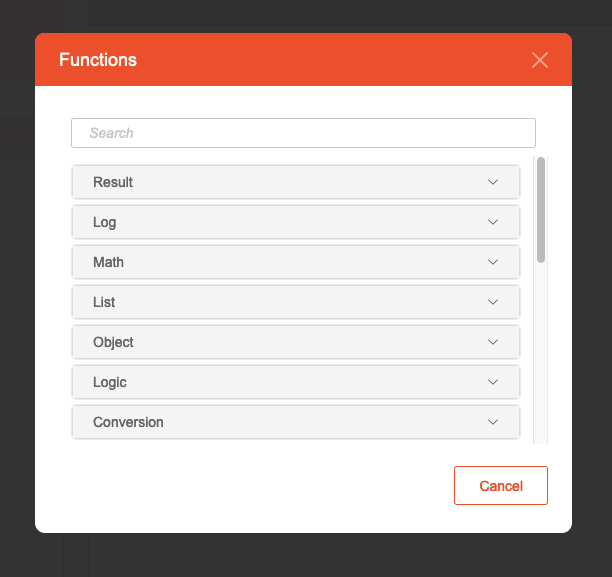

# Scheduler - Action

## Description

Create the functionality of the Scheduler by using the function blocks available in eMOBIQ. Combine these
function blocks cohesively to execute a desired task for the Action.

## Overview

1. **Action flow**: A workspace to build the flow of functions.
2. **Function list**: A list of eMOBIQ function block for use.
3. **Inspector**: Modify the input parameters of a function block.

## How to use

### Building the flow

1. A brand new Action Flow will have a **Start** and **End** terminating block.
   
2. Look for the function block to use in the Function List window, use the search field to quickly find the desired
   block. (Refer to the documentation under the "Function" section to obtain more detailed information about the
   function block).
3. Drag and drop the block to use to the connection point (represented by the black circle between each block in flow).
    * Alternatively, you may right click the connection point to quickly insert function block at the exact place. A
      function selection popup will appear.
      
4. Proceed with the remaining blocks and continue until complete. Remember to use the `Result.setAPI` block to terminate
   the API flow and assign a result.

### Copy & paste a function block

1. Inside the action flow, highlight the function block to copy.
2. On the top right of the action flow window, click on the `Copy` icon. The block will be copied into the internal
   clipboard.
3. Highlight a connection point you want to place the block to.
4. On the top right of the action flow window, click on the `Paste` icon. The block will then be pasted at the position
   just under the connection point.

### Removing a function block

1. Inside the action flow, highlight the function block to remove.
2. On the top right of the action flow window, click on the `Delete` icon.
3. Confirm the deletion, and the block, including its subflow if available, will be removed.

### Modifying the parameter of a function block

1. Inside the action flow, highlight the function block.
2. Use the Inspector window to check the input parameters available, and if needed, set a desired value.
   
3. Click on the left symbol button to change the parameter type. The following options are available:
    * **value**: A literal value, e.g. a text or number. Value entered in the field will be used as is.
    * **param**: Take the value from the global parameter. Only applicable in user-defined Global functions. Specify the
      parameter key in the field.
    * **input**: Take the value from the surrounding function with callbacks, for example, `Control.forLoop`. The value
      will be available if the current block is inside a function callback.
    * **inputField**: Same as **input**, but obtain the value from an attribute if it is a object. Specify the key in
      the field.
    * **extra**: Take the value from the extra parameter provided by the surrounding function with callbacks. The value
      will be available if the current block is inside a function callback.
    * **extraField**: Same as **extra**, but obtain the value from an attribute if it is a object. Specify the key in
      the field.
    * **function**: Take the value from a result of another function call. A new sub-flow will be opened where you may
      specify what action will it return. Only a single block with returning result is allowed, but function can be
      nested.
      

### Creating user defined functions

To reuse a part of the flow and create a custom function,

1. On the right panel, open up User Defined tab.
   
2. On the middle section, you will see the list of user defined function that have been created. Add a new one by selecting the plus ("+') icon.
3. Provide a name for the custom function.
4. The Inspector window will appear as follows. You may add the list of input parameters for the function by clicking **add new**.
   
5. Construct the action flow for the function.
   * To read the input parameters, use the parameter type "parameter" in the inspector window. Provide the name of the parameter to read.
   * To return a value, your function must have a `Result.setUserDefined` function block.
      
6. Your custom function will then be shown inside the function list under "UserDefined" category, ready to be used.
   
